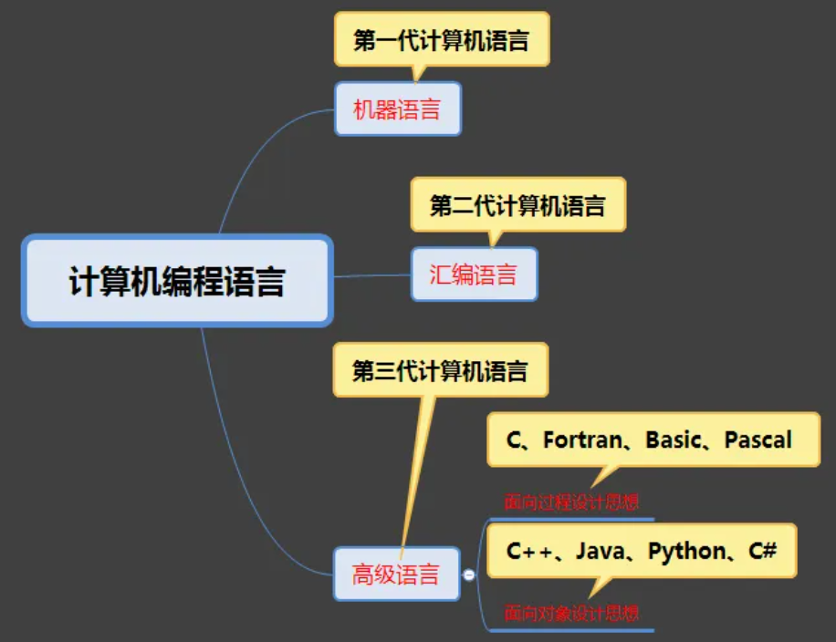
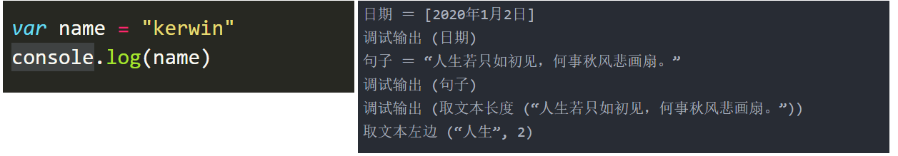
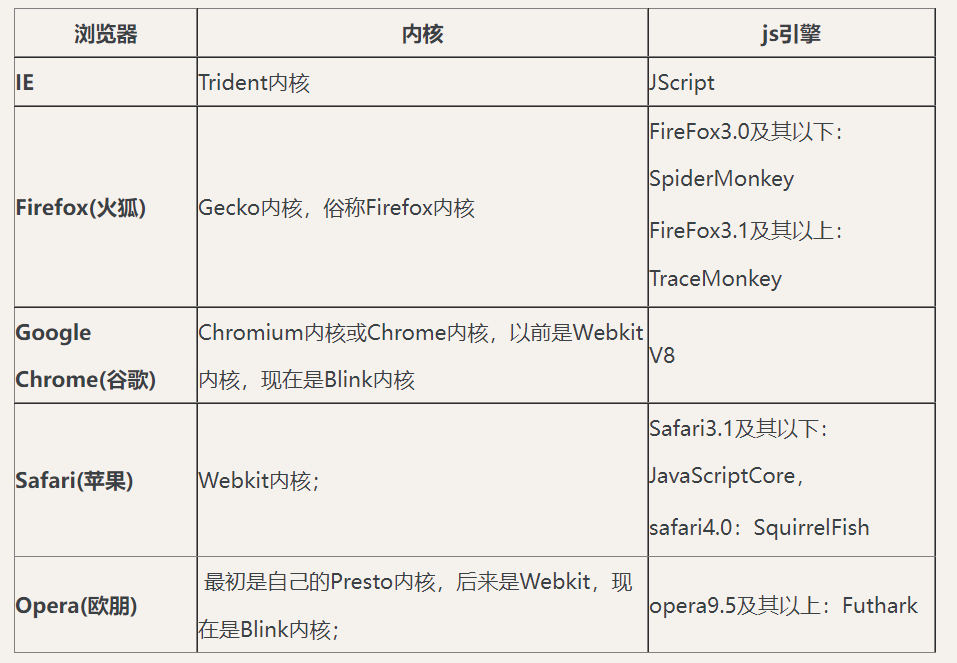
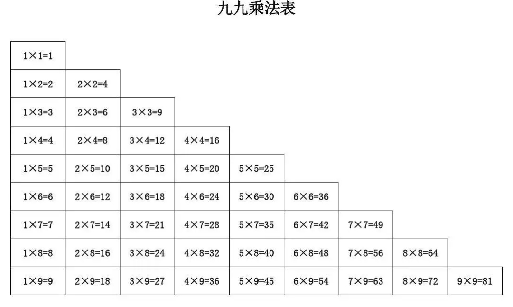
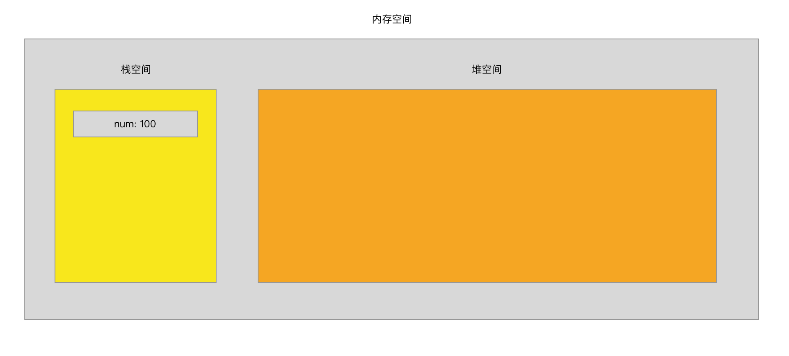
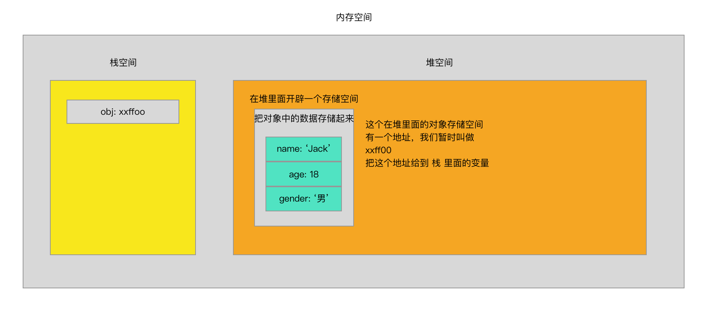
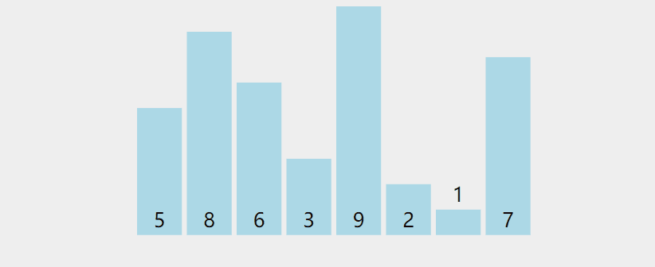
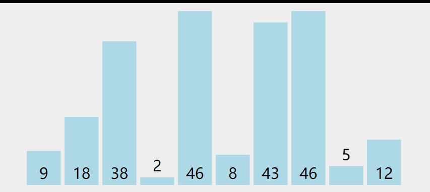

- [JavaScript](#javascript)
  - [前言](#前言)
    - [1.计算机语言](#1计算机语言)
    - [2.分类](#2分类)
  - [一.JavaScript基础](#一javascript基础)
    - [1.JavaScript发展历史（JS）](#1javascript发展历史js)
    - [2.JavaScript的组成](#2javascript的组成)
    - [3.JavaScript能干什么](#3javascript能干什么)
    - [6.数据类型（重点）](#6数据类型重点)
    - [7.数据类型转换](#7数据类型转换)
      - [7.1 其他数据类型转成数值](#71-其他数据类型转成数值)
      - [7.2 其他数据类型转成字符串](#72-其他数据类型转成字符串)
      - [7.3 其他数据类型转成布尔](#73-其他数据类型转成布尔)
    - [8.运算符](#8运算符)
      - [8-1 数学运算符](#8-1-数学运算符)
      - [8-2 赋值运算符](#8-2-赋值运算符)
      - [8-3 比较运算符](#8-3-比较运算符)
      - [8-4 逻辑运算符](#8-4-逻辑运算符)
      - [8-5 自增自减运算符](#8-5-自增自减运算符)
    - [9.三元运算符](#9三元运算符)
    - [10.分支结构](#10分支结构)
      - [10-1 IF 条件分支结构（重点）](#10-1-if-条件分支结构重点)
      - [10-2 SWITCH 条件分支结构（重点）](#10-2-switch-条件分支结构重点)
    - [11.循环结构（重点）](#11循环结构重点)
      - [11-1 WHILE 循环](#11-1-while-循环)
      - [11-2 DO WHILE 循环](#11-2-do-while-循环)
      - [11-3 FOR 循环](#11-3-for-循环)
      - [11-4 BREAK 终止循环](#11-4-break-终止循环)
      - [11-5 CONTINUE 结束本次循环](#11-5-continue-结束本次循环)
    - [12.函数的概念](#12函数的概念)
      - [12-1 函数定义阶段](#12-1-函数定义阶段)
      - [12-2 函数调用阶段](#12-2-函数调用阶段)
      - [12-3 调用上的区别](#12-3-调用上的区别)
      - [12-4 函数的参数](#12-4-函数的参数)
      - [12-5 函数的return](#12-5-函数的return)
      - [12-6 预解析（重点）](#12-6-预解析重点)
      - [12-7 作用域](#12-7-作用域)
      - [12-8 变量使用规则](#12-8-变量使用规则)
    - [13.对象](#13对象)
      - [13-1 创建对象](#13-1-创建对象)
      - [13-2 数据类型之间存储的区别](#13-2-数据类型之间存储的区别)
    - [14.数组](#14数组)
      - [14-1 创建一个数组](#14-1-创建一个数组)
      - [14-2 数组的 length](#14-2-数组的-length)
      - [14-3 数组的索引](#14-3-数组的索引)
      - [14-4 数组的排序](#14-4-数组的排序)
      - [14-5 数组的常用方法](#14-5-数组的常用方法)
    - [15.字符串](#15字符串)
      - [15-1 创建字符串](#15-1-创建字符串)
      - [15-2 字符集](#15-2-字符集)
      - [15-3 字符串的常用方法](#15-3-字符串的常用方法)
    - [16.Math](#16math)
      - [16-1 random](#16-1-random)
      - [16-2 round](#16-2-round)
      - [16-3 abs](#16-3-abs)
      - [16-4 ceil](#16-4-ceil)
      - [16-5 floor](#16-5-floor)
      - [16-6 max](#16-6-max)
      - [16-7 min](#16-7-min)
      - [16-8 PI](#16-8-pi)
    - [17.Date](#17date)
      - [17-1 new Date()](#17-1-new-date)
      - [17-2  将日期字符串格式化成指定内容](#17-2--将日期字符串格式化成指定内容)
    - [18.定时器](#18定时器)
      - [18-1 倒计时定时器](#18-1-倒计时定时器)
      - [18-2 间隔定时器](#18-2-间隔定时器)
      - [18-3 定时器的返回值](#18-3-定时器的返回值)
      - [18-4 关闭定时器](#18-4-关闭定时器)
  - [二.BOM](#二bom)
  - [三.DOM](#三dom)
  - [四.正则表达式](#四正则表达式)
  - [五.面向对象](#五面向对象)
  - [六.AJAX](#六ajax)
  - [七.JQuery](#七jquery)
  - [八.Swiper](#八swiper)
  - [九.BootStrap](#九bootstrap)
  - [十.Sass](#十sass)

### JavaScript

#### 前言

##### 1.计算机语言

计算机语言（Computer Language）指用于人与计算机之间通讯的语言。计算机语言是人与计算机之间传递信息的媒介。计算机系统最大特征是指令通过一种语言传达给机器。为了使电子计算机进行各种工作，就需要有一套用以编写计算机程序的数字、字符和语法规划，由这些[字符](https://baike.baidu.com/item/字符/4768913)和[语法规则](https://baike.baidu.com/item/语法规则/1095093)组成计算机各种指令（或各种语句）。这些就是计算机能接受的语言。

##### 2.分类






#### 一.JavaScript基础

##### 1.JavaScript发展历史（JS）

```txt
1. 1994年，网景公司(Netscape)发布了Navigator浏览器0.9版，这是世界上第一款比较成熟的网络浏览器，轰动一时。但是这是一款名副其实的浏览器--只能浏览页面，浏览器无法与用户互动,当时解决这个问题有两个办法，一个是采用现有的语言,许它们直接嵌入网页。另一个是发明一种全新的语言。
	liveScript ==> javaScript ==> ECMAscript

2. 1995年Sun公司将Oak语言改名为Java，正式向市场推出。Sun公司大肆宣传，许诺这种语言可以"一次编写，到处运	 行"(Write Once, Run Anywhere)，它看上去很可能成为未来的主宰。

3. 网景公司动了心，决定与Sun公司结成联盟

4. 34岁的系统程序员Brendan Eich登场了。1995年4月，网景公司录用了他,他只用10天时间就把Javascript设计出来了。

5.
	(1)借鉴C语言的基本语法
	(2)借鉴Java语言的数据类型和内存管理
	(3)借鉴Scheme语言，将函数提升到"第一等公民"(first class)的地位
	(4)借鉴Self语言，使用基于原型(prototype)的继承机制
```


##### 2.JavaScript的组成




```txt
1. ECMASCRIPT: 定义了javascript的语法规范,描述了语言的基本语法和数据类型
2. BOM (Browser Object Model): 浏览器对象模型
  - 有一套成熟的可以操作浏览器的 API，通过 BOM 可以操作浏览器。比如： 弹出框、浏览器跳转、获取分辨率等
3. DOM (Document Object Model): 文档对象模型
  - 有一套成熟的可以操作页面元素的 API，通过 DOM 可以操作页面中的元素。比如： 增加个 div，减少个 div，给 div 换个位置等
```

总结： **JS 就是通过固定的语法去操作 浏览器 和 标签结构 来实现网页上的各种效果**


##### 3.JavaScript能干什么

```txt
1. 常见的网页效果【表单验证，轮播图。。。】
2. 与H5配合实现游戏【水果忍者： http://www.jq22.com/demo/html5-fruit-ninja/】
3. 实现应用级别的程序【http://naotu.baidu.com】
4. 实现图表统计效果【https://echarts.apache.org/examples/zh/】
5. js可以实现人工智能【面部识别】
6. 后端开发，app开发，桌面端开发......
```


##### 6.数据类型（重点）

- 是指我们存储在内存中的数据的类型
- 我们通常分为两大类 **基本数据类型** 和 **复杂数据类型**


**基本数据类型**

1. 数值类型（number）
   - 一切数字都是数值类型（包括二进制，十进制，十六进制等）
   - `NaN`（not a number），一个非数字
2. 字符串类型（string）
   - 被引号包裹的所有内容（可以是单引号也可以是双引号）
3. 布尔类型（boolean）
   - 只有两个（`true` 或者 `false`）
4. null类型（null）
   - 只有一个，就是 `null`，表示空的意思
5. undefined类型（undefined）
   - 只有一个，就是 `undefined`，表示没有值的意思


**判断数据类型** 

- 既然已经把数据分开了类型，那么我们就要知道我们存储的数据是一个什么类型的数据
- 使用 `typeof` 关键字来进行判断

```javascript
// 第一种使用方式
var n1 = 100;
console.log(typeof n1);

// 第二种使用方式
var s1 = 'abcdefg';
console.log(typeof(s1));
```


##### 7.数据类型转换

- 数据类型之间的转换，比如数字转成字符串，字符串转成布尔，布尔转成数字等


###### 7.1 其他数据类型转成数值

1. `Number(变量)`

   > 可以把一个变量强制转换成数值类型
   >
   > 可以转换小数，会保留小数
   >
   > 可以转换布尔值
   >
   > 遇到不可转换的都会返回 `NaN`

2. `parseInt(变量)`

   > 从第一位开始检查，是数字就转换，知道一个不是数字的内容
   >
   > 开头就不是数字，那么直接返回 `NaN`
   >
   > 不认识小数点，只能保留整数
3. `parseFloat(变量)`

   > 从第一位开始检查，是数字就转换，知道一个不是数字的内容
   >
   > 开头就不是数字，那么直接返回 `NaN`
   >
   > 认识一次小数点

4. 除了加法以外的数学运算

   > 运算符两边都是可运算数字才行
   >
   > 如果运算符任何一遍不是一个可运算数字，那么就会返回 `NaN`
   >
   > 加法不可以用


###### 7.2 其他数据类型转成字符串

1. `变量.toString()`

   > 有一些数据类型不能使用 `toString()` 方法，比如 `undefined` 和 `null`

2. `String(变量)`

   > 所有数据类型都可以

3. 使用加法运算

   > 在 JS 里面，`+` 由两个含义
   >
   > 字符串拼接： 只要 `+` 任意一边是字符串，就会进行字符串拼接
   >
   > 加法运算：只有 `+` 两边都是数字的时候，才会进行数学运算


###### 7.3 其他数据类型转成布尔

1. `Boolean(变量)`

   > 在 js 中，只有 `''`、`0`、`null`、`undefined`、`NaN`，这些是 `false`
   >
   > 其余都是 `true`


##### 8.运算符

- 就是在代码里面进行运算的时候使用的符号，不光只是数学运算，我们在 `js` 里面还有很多的运算方式


###### 8-1 数学运算符

1. `+`

   > 只有符号两边都是数字的时候才会进行加法运算
   >
   > 只要符号任意一边是字符串类型，就会进行字符串拼接

2. `-`

   > 会执行减法运算
   >
   > 会自动把两边都转换成数字进行运算

3. `*`

   > 会执行乘法运算
   >
   > 会自动把两边都转换成数字进行运算

4. `/`

   > 会执行除法运算
   >
   > 会自动把两边都转换成数字进行运算

5. `%`

   > 会执行取余运算
   >
   > 会自动把两边都转换成数字进行运算


###### 8-2 赋值运算符

1. `=`

   > 就是把 `=` 右边的赋值给等号左边的变量名
   >
   > `var num = 100`
   >
   > 就是把 100 赋值给 num 变量
   >
   > 那么 num 变量的值就是 100

2. `+=`

   > ```javascript
   > var a = 10;
   > a += 10;
   > console.log(a); //=> 20
   > ```
   >
   > `a += 10` 等价于 `a = a + 10`

3. `-=`

   > var a = 10;
   > ```javascript
   > a -= 10;
   > console.log(a); //=> 0
   > ```
   >
   > `a -= 10` 等价于 `a = a - 10`

4. `*=`

   > ```javascript
   > var a = 10;
   > a *= 10;
   > console.log(a); //=> 100
   > ```
   >
   > `a *= 10` 等价于 `a = a * 10`

5. `/+`

   > ```javascript
   > var a = 10;
   > a /= 10;
   > console.log(a); //=> 1
   > ```
   >
   > `a /= 10` 等价于 `a = a / 10`

6. `%=`

   > ```javascript
   > var a = 10;
   > a %= 10;
   > console.log(a); //=> 0
   > ```
   >
   > `a %= 10` 等价于 `a = a % 10`


######  8-3 比较运算符

1. `==`

   - 比较符号两边的值是否相等，不管数据类型
      >`1 == '1'`
      >
      >两个的值是一样的，所以得到 `true`
   
2. `===`

   - 比较符号两边的值和数据类型是否都相等
      >`1 === '1'`
      >
      >两个值虽然一样，但是因为数据类型不一样，所以得到 `false`
   
3. `!=`

   - 比较符号两边的值是否不等
      >
      >`1 != '1'`
      >
      >因为两边的值是相等的，所以比较他们不等的时候得到 `false`

4. `!==`

   - 比较符号两边的数据类型和值是否不等
      >`1 !== '1'`
      >
      >因为两边的数据类型确实不一样，所以得到 `true`
   
5. `>=`

   - 比较左边的值是否 **大于或等于** 右边的值
      >
      >`1 >= 1`  结果是 `true`
      >
      >`1 >= 0`  结果是 `true`
      >
      >`1 >= 2`  结果是 `false`

6. `<=`

   - 比较左边的值是否 **小于或等于** 右边的值
      >
      >`1 <= 2`  结果是 `true`
      >
      >`1 <= 1`  结果是 `true`
      >
      >`1 <= 0`  结果是 `false`

7. `>`

   - 比较左边的值是否 **大于** 右边的值
      >
      >`1 > 0`  结果是 `true`
      >
      >`1 > 1`  结果是 `false`
      >
      >`1 > 2`  结果是 `false`

8. `<`

   - 比较左边的值是否 **小于** 右边的值
      >
      >`1 < 2`  结果是 `true`
      >
      >`1 < 1`  结果是 `false`
      >
      >`1 < 0`  结果是 `false`


###### 8-4 逻辑运算符

1. `&&`

   - 进行 且 的运算
      >
      >符号左边必须为 `true` 并且右边也是 `true`，才会返回 `true`
      >
      >只要有一边不是 `true`，那么就会返回 `false`
      >
      >`true && true`  结果是 `true`
      >
      >`true && false`  结果是 `false`
      >
      >`false && true`  结果是 `false`
      >
      >`false && false`  结果是 `false`

2. `||`

   - 进行 或 的运算
      >
      >符号的左边为 `true` 或者右边为 `true`，都会返回 `true`
      >
      >只有两边都是 `false` 的时候才会返回 `false`
      >
      >`true || true`  结果是 `true`
      >
      >`true || false`  结果是 `true`
      >
      >`false || true`  结果是 `true`
      >
      >`false || false`  结果是 `false`

3. `!`

   - 进行 取反 运算
      >
      >本身是 `true` 的，会变成 `false`
      >
      >本身是 `false` 的，会变成 `true`
      >
      >`!true`  结果是 `false`
      >
      >`!false`  结果是 `true`


###### 8-5 自增自减运算符

1. `++`

   - 进行自增运算

   - 分成两种，**前置++** 和 **后置++**

   - 前置++，会先把值自动 +1，在返回

     ```javascript
     var a = 10;
     console.log(++a);
     // 会返回 11，并且把 a 的值变成 11
     ```

   - 后置++，会先把值返回，在自动+1

     ```javascript
     var a = 10;
     console.log(a++);
     // 会返回 10，然后把 a 的值变成 11
     ```

2. `--`

   - 进行自减运算
   - 分成两种，**前置--** 和 **后置--**
   - 和 `++` 运算符道理一样


##### 9.三元运算符

- 三元运算，就是用 **两个符号** 组成一个语句

- 语法： `条件 ? 条件为 true 的时候执行 : 条件为 false 的时候执行`

  ```javascript
  var age = 18;
  age >= 18 ? alert('已经成年') : alert('没有成年')
  ```


##### 10.分支结构

- 我们的 `js` 代码都是顺序执行的（从上到下）
- 逻辑分支就是根据我们设定好的条件来决定要不要执行某些代码


###### 10-1 IF 条件分支结构（重点）

**if 语句**

- 通过一个 `if` 语句来决定代码是否执行

- 语法： `if (条件) { 要执行的代码 }`

- 通过 `()` 里面的条件是否成立来决定 `{}` 里面的代码是否执行

  ```javascript
  // 条件为 true 的时候执行 {} 里面的代码
  if (true) {
    alert('因为条件是 true，我会执行')
  }
  
  // 条件为 false 的时候不执行 {} 里面的代码
  if (false) {
  	alert('因为条件是 false，我不会执行')    
  }
  ```


**if else 语句**

- 通过 `if` 条件来决定，执行哪一个 `{}` 里面的代码

- 语法： `if (条件) { 条件为 true 的时候执行 } else { 条件为 false 的时候执行 }`

- 两个 `{}` 内的代码一定有一个会执行

  ```javascript
  // 条件为 true 的时候，会执行 if 后面的 {} 
  if (true) {
    alert('因为条件是 true，我会执行')
  } else {
    alert('因为条件是 true，我不会执行')
  }
  
  // 条件为 false 的时候，会执行 else 后面的 {}
  if (false) {
    alert('因为条件为 false，我不会执行')
  } else {
    alert('因为条件为 false，我会执行')
  }
  ```


**if else if ... 语句**

- 可以通过 `if` 和 `else if` 来设置多个条件进行判断

- 语法：`if (条件1) { 条件1为 true 的时候执行 } else if (条件2) { 条件2为 true 的时候执行 }`

- 会从头开始依次判断条件

  - 如果第一个条件为 `true` 了，那么就会执行后面的 `{}` 里面的内容
  - 如果第一个条件为 `false`，那么就会判断第二个条件，依次类推

- 多个 `{}` ，只会有一个被执行，一旦有一个条件为 `true` 了，后面的就不在判断了

  ```javascript
  // 第一个条件为 true，第二个条件为 false，最终会打印 “我是代码段1”
  if (true) {
    	alert('我是代码段1')
  } else if (false) {
  	alert('我是代码段2')           
  }
  
  // 第一个条件为 true，第二个条件为 true，最终会打印 “我是代码段1”
  // 因为只要前面有一个条件满足了，就不会继续判断了
  if (true) {
    	alert('我是代码段1')
  } else if (true) {
    	alert('我是代码段2')
  }
  
  // 第一个条件为 false，第二个条件为 true，最终会打印 “我是代码段2”
  // 只有前一个条件为 false 的时候才会继续向后判断
  if (false) {
    	alert('我是代码段1')
  } else if (true) {
    	alert('我是代码段2')
  }
  
  // 第一个条件为 false，第二个条件为 false，最终什么也不会发生
  // 因为当所有条件都为 false 的时候，两个 {} 里面的代码都不会执行
  if (false) {
    	alert('我是代码段1')
  } else if (false) {
    	alert('我是代码段2')
  }
  ```


**if else if … else 语句**

- 和之前的 `if else if ...` 基本一致，只不过是在所有条件都不满足的时候，执行最后 `else` 后面的 `{}`

  ```javascript
  // 第一个条件为 false，第二个条件为 false，最终会打印 “我是代码段3”
  // 只有前面所有的条件都不满足的时候会执行 else 后面的 {} 里面的代码
  // 只要前面有一个条件满足了，那么后面的就都不会执行了
  if (false) {
    	alert('我是代码段1')
  } else if (false) {
    	alert('我是代码段2')
  } else {
    	alert('我是代码段3')
  }
  ```


###### 10-2 SWITCH 条件分支结构（重点）

- 也是条件判断语句的一种

- 是对于某一个变量的判断

- 语法：

  ```javascript
  switch (要判断的变量) {
    case 情况1:
      情况1要执行的代码
      break
    case 情况2:
      情况2要执行的代码
      break
    case 情况3:
      情况3要执行的代码
      break
    default:
      上述情况都不满足的时候执行的代码
  }
  ```

  - 要判断某一个变量 **等于** 某一个值得时候使用

- 例子🌰： 根据变量给出的数字显示是星期几

  ```javascript
  var week = 1
  switch (week) {
    case 1:
      alert('星期一')
      break
    case 2:
      alert('星期二')
      break
    case 3:
      alert('星期三')
      break
    case 4:
      alert('星期四')
      break
    case 5:
      alert('星期五')
      break
    case 6:
      alert('星期六')
      break
    case 7:
      alert('星期日')
      break
    default:
      alert('请输入一个 1 ～ 7 之间的数字')
  }
  ```

  

##### 11.循环结构（重点）

- 循环结构，就是根据某些给出的条件，重复的执行同一段代码
- 循环必须要有某些固定的内容组成
  1. 初始化
  2. 条件判断
  3. 要执行的代码
  4. 自身改变


###### 11-1 WHILE 循环

- `while`，中文叫 当…时，其实就是当条件满足时就执行代码，一旦不满足了就不执行了

- 语法 `while (条件) { 满足条件就执行 }`

- 因为满足条件就执行，所以我们写的时候一定要注意，就是设定一个边界值，不然就一直循环下去了

  ```javascript
  // 1. 初始化条件
  var num = 0;
  // 2. 条件判断
  while (num < 10) {
    // 3. 要执行的代码
    console.log('当前的 num 的值是 ' + num)
    // 4. 自身改变
    num = num + 1
  }
  ```

  - 如果没有自身改变，那么就会一直循环不停了


###### 11-2 DO WHILE 循环

- 是一个和 `while` 循环类似的循环

- `while` 会先进行条件判断，满足就执行，不满足直接就不执行了

- 但是 `do while` 循环是，先不管条件，先执行一回，然后在开始进行条件判断

- 语法： `do { 要执行的代码 } while (条件)`

  ```javascript
  // 下面这个代码，条件一开始就不满足，但是依旧会执行一次 do 后面 {} 内部的代码
  var num = 10
  do {
    console.log('我执行了一次')
    num = num + 1
  } while (num < 10)
  ```

  

###### 11-3 FOR 循环

- 和 `while` 和 `do while` 循环都不太一样的一种循环结构

- 道理是和其他两种一样的，都是循环执行代码的

- 语法： `for (var i = 0; i < 10; i++) { 要执行的代码 }`

  ```javascript
  // 把初始化，条件判断，自身改变，写在了一起
  for (var i = 1; i <= 10; i++) {
    // 这里写的是要执行的代码
    console.log(i)
  }
  
  // 控制台会依次输出 1 ~ 10 
  ```

- 这个只是看起来不太舒服，但是用起来比较好用


###### 11-4 BREAK 终止循环

- 在循环没有进行完毕的时候，因为我设置的条件满足，提前终止循环

- 比如：我要吃五个包子，吃到三个的时候，不能在吃了，我就停止吃包子这个事情

- 要终止循环，就可以直接使用 `break` 关键字

  ```javascript
  for (var i = 1; i <= 5; i++) {
    // 没循环一次，吃一个包子
    console.log('我吃了一个包子')
    // 当 i 的值为 3 的时候，条件为 true，执行 {} 里面的代码终止循环
    // 循环就不会继续向下执行了，也就没有 4 和 5 了
    if (i === 3) {
      break
    }
  }
  ```


###### 11-5 CONTINUE 结束本次循环

- 在循环中，把循环的本次跳过去，继续执行后续的循环

- 比如：吃五个包子，到第三个的时候，第三个掉地下了，不吃了，跳过第三个，继续吃第四个和第五个

- 跳过本次循环，就可以使用 `continue` 关键字

  ```javascript
  for (var i = 1; i <= 5; i++) {
    // 当 i 的值为 3 的时候，执行 {} 里面的代码
    // {} 里面有 continue，那么本次循环后面的代码就都不执行了
    // 自动算作 i 为 3 的这一次结束了，去继续执行 i = 4 的那次循环了
    if (i === 3) {
      console.log('这个是第三个包子，掉地下了，我不吃了')
      continue
    }
    console.log('我吃了一个包子')
  }
  ```




##### 12.函数的概念

- 对于 `js` 来说，函数就是把任意一段代码放在一个 **盒子** 里面

- 在我想要让这段代码执行的时候，直接执行这个 **盒子** 里面的代码就行

- 先看一段代码

  ```javascript
  // 这个是我们以前写的一段代码
  for (var i = 0; i < 10; i++) {
    console.log(i)
  }
  
  // 函数，这个 {} 就是那个 “盒子”
  function fn() {
    // 这个函数我们以前写的代码
    for (var i = 0; i < 10; i++) {
      console.log(i)
    }
  }
  ```


###### 12-1 函数定义阶段

- 定义阶段就是我们把代码 **放在盒子里面**

- 我们就要学习怎么 **放进去**，也就是书写一个函数
- 我们有两种定义方式 **声明式** 和 **赋值式**


**声明式**

- 使用 `function` 这个关键字来声明一个函数

- 语法：

  ```javascript
  function fn() {
    // 一段代码
  }
  // function: 声明函数的关键字，表示接下来是一个函数了
  // fn: 函数的名字，我们自己定义的（遵循变量名的命名规则和命名规范）
  // (): 必须写，是用来放参数的位置（一会我们再聊）
  // {}: 就是我们用来放一段代码的位置（也就是我们刚才说的 “盒子”）
  ```


**赋值式**

- 其实就是和我们使用 `var` 关键字是一个道理了

- 首先使用 `var` 定义一个变量，把一个函数当作值直接赋值给这个变量就可以了

- 语法： 

  ```javascript
  var fn = function () {
    // 一段代码
  }
  // 不需要在 function 后面书写函数的名字了，因为在前面已经有了
  ```

  

###### 12-2 函数调用阶段

- 就是让 **盒子里面** 的代码执行一下
- 让函数执行
- 两种定义函数的方式不同，但是调用函数的方式都以一样的


**调用一个函数**

- 函数调用就是直接写 `函数名()` 就可以了

  ```javascript
  // 声明式函数
  function fn() {
    console.log('我是 fn 函数')
  }
  
  // 调用函数
  fn()
  
  // 赋值式函数
  var fn2 = function () {
    console.log('我是 fn2 函数')
  }
  
  // 调用函数
  fn()
  ```

  - 注意： **定义完一个函数以后，如果没有函数调用，那么写在 {} 里面的代码没有意义，只有调用以后才会执行**


###### 12-3 调用上的区别

- 虽然两种定义方式的调用都是一样的，但是还是有一些区别的

- 声明式函数： 调用可以在 **定义之前或者定义之后**

  ```javascript
  // 可以调用
  fn()
  
  // 声明式函数
  function fn() {
    console.log('我是 fn 函数')
  }
  
  // 可以调用
  fn()
  ```

- 赋值式函数： 调用只能在 **定义之后**

  ```javascript
  // 会报错
  fn()
  
  // 赋值式函数
  var fn = function () {
    console.log('我是 fn 函数')
  }
  
  // 可以调用
  fn()
  ```

  

###### 12-4 函数的参数

- 我们在定义函数和调用函数的时候都出现过 `()`

- 现在我们就来说一下这个 `()` 的作用

- 就是用来放参数的位置

- 参数分为两种 **行参** 和 **实参**

  ```javascript
  // 声明式
  function fn(行参写在这里) {
    // 一段代码
  }
  
  fn(实参写在这里)
  
  // 赋值式函数
  var fn = function (行参写在这里) {
    // 一段代码
  }
  fn(实参写在这里)
  ```


**行参和实参的作用**

1. 行参

   - 就是在函数内部可以使用的变量，在函数外部不能使用

   - 每写一个单词，就相当于在函数内部定义了一个可以使用的变量（遵循变量名的命名规则和命名规范）

   - 多个单词之间以 `,` 分隔

     ```javascript
     // 书写一个参数
     function fn(num) {
       // 在函数内部就可以使用 num 这个变量
     }
     
     var fn1 = function (num) {
     	// 在函数内部就可以使用 num 这个变量
     }
     
     // 书写两个参数
     function fun(num1, num2) {
       // 在函数内部就可以使用 num1 和 num2 这两个变量
     }
     
     var fun1 = function (num1, num2) {
       // 在函数内部就可以使用 num1 和 num2 这两个变量
     }
     ```

   - 如果只有行参的话，那么在函数内部使用的值个变量是没有值的，也就是 `undefined`

   - **行参的值是在函数调用的时候由实参决定的**

2. 实参

   - 在函数调用的时候给行参赋值的

   - 也就是说，在调用的时候是给一个实际的内容的

     ```javascript
     function fn(num) {
       // 函数内部可以使用 num 
     }
     
     // 这个函数的本次调用，书写的实参是 100
     // 那么本次调用的时候函数内部的 num 就是 100
     fn(100) 
     
     // 这个函数的本次调用，书写的实参是 200
     // 那么本次调用的时候函数内部的 num 就是 200
     fn(200)
     ```

   - **函数内部的行参的值，由函数调用的时候传递的实参决定**

   - **多个参数的时候，是按照顺序一一对应的**

     ```javascript
     function fn(num1, num2) {
       // 函数内部可以使用 num1 和 num2
     }
     
     // 函数本次调用的时候，书写的参数是 100 和 200
     // 那么本次调用的时候，函数内部的 num1 就是 100，num2 就是 200
     fn(100, 200)
     ```

     

**参数个数的关系**

1. 行参比实参少

   - 因为是按照顺序一一对应的

   - 行参少就会拿不到实参给的值，所以在函数内部就没有办法用到这个值

     ```javascript
     function fn(num1, num2) {
       // 函数内部可以使用 num1 和 num2
     }
     
     // 本次调用的时候，传递了两个实参，100 200 和 300
     // 100 对应了 num1，200 对应了 num2，300 没有对应的变量
     // 所以在函数内部就没有办法依靠变量来使用 300 这个值
     fn(100, 200, 300)
     ```

     

2. 行参比实参多

   - 因为是按照顺序一一对应的

   - 所以多出来的行参就是没有值的，就是 `undefined`

     ```javascript
     function fn(num1, num2, num3) {
       // 函数内部可以使用 num1 num2 和 num3
     }
     
     // 本次调用的时候，传递了两个实参，100 和 200
     // 就分别对应了 num1 和 num2
     // 而 num3 没有实参和其对应，那么 num3 的值就是 undefined
     fn(100, 200)
     ```

     

###### 12-5 函数的return

- `return` 返回的意思，其实就是给函数一个 **返回值** 和 **终断函数**


**返回值**

- 函数调用本身也是一个表达式，表达式就应该有一个值出现

- 现在的函数执行完毕之后，是不会有结果出现的

  ```javascript
  // 比如 1 + 2 是一个表达式，那么 这个表达式的结果就是 3
  console.log(1 + 2) // 3
  
  function fn() {
    // 执行代码
  }
  
  // fn() 也是一个表达式，这个表达式就没有结果出现
  console.log(fn()) // undefined
  ```

- `return` 关键字就是可以给函数执行完毕一个结果

  ```javascript
  function fn() {
    // 执行代码
    return 100
  }
  
  // 此时，fn() 这个表达式执行完毕之后就有结果出现了
  console.log(fn()) // 100
  ```

  - 我们可以在函数内部使用 `return` 关键把任何内容当作这个函数运行后的结果


**终断函数**

- 当我开始执行函数以后，函数内部的代码就会从上到下的依次执行

- 必须要等到函数内的代码执行完毕

- 而 `return` 关键字就是可以在函数中间的位置停掉，让后面的代码不在继续执行

  ```javascript
  function fn() {
    console.log(1)
    console.log(2)
    console.log(3)
    
    // 写了 return 以后，后面的 4 和 5 就不会继续执行了
    return
    console.log(4)
    console.log(5)
  }
  
  // 函数调用
  fn()
  ```


###### 12-6 预解析（重点）

- **预解析** 其实就是聊聊 `js` 代码的编译和执行
- `js` 是一个解释型语言，就是在代码执行之前，先对代码进行通读和解释，然后在执行代码
- 也就是说，我们的 `js` 代码在运行的时候，会经历两个环节 **解释代码** 和 **执行代码**


**解释代码**

- 因为是在所有代码执行之前进行解释，所以叫做 **预解析（预解释）**

- 需要解释的内容有两个

  - 声明式函数
    - 在内存中先声明有一个变量名是函数名，并且这个名字代表的内容是一个函数
  - `var` 关键字
    - 在内存中先声明有一个变量名

- 看下面一段代码

  ```javascript
  fn()
  console.log(num)
  
  function fn() {
    console.log('我是 fn 函数')
  }
  
  var num = 100
  ```

- 经过预解析之后可以变形为

  ```javascript
  function fn() {
    console.log('我是 fn 函数')
  }
  var num
  
  fn()
  console.log(num)
  num = 100
  ```

- 赋值式函数会按照 `var` 关键字的规则进行预解析


###### 12-7 作用域

- 什么是作用域，就是一个变量可以生效的范围
- 变量不是在所有地方都可以使用的，而这个变量的使用范围就是作用域


**全局作用域**

- 全局作用域是最大的作用域

- 在全局作用域中定义的变量可以在任何地方使用

- 页面打开的时候，浏览器会自动给我们生成一个全局作用域 `window`

- 这个作用域会一直存在，直到页面关闭就销毁了

  ```javascript
  // 下面两个变量都是存在在全局作用域下面的，都是可以在任意地方使用的
  var num = 100
  var num2 = 200
  ```


**局部作用域**

- 局部作用域就是在全局作用域下面有开辟出来的一个相对小一些的作用域

- 在局部作用域中定义的变量只能在这个局部作用域内部使用

- **在 `JS` 中只有函数能生成一个局部作用域，别的都不行**

- 每一个函数，都是一个局部作用域

  ```javascript
  // 这个 num 是一个全局作用域下的变量 在任何地方都可以使用
  var num = 100
  
  function fn() {
    // 下面这个变量就是一个 fn 局部作用域内部的变量
    // 只能在 fn 函数内部使用
    var num2 = 200
  }
  
  fn()
  ```

  

###### 12-8 变量使用规则

- 有了作用域以后，变量就有了使用范围，也就有了使用规则
- 变量使用规则分为两种，**访问规则** 和 **赋值规则**


**访问规则**

- 当我想获取一个变量的值的时候，我们管这个行为叫做 **访问**

- 获取变量的规则： 

  - 首先，在自己的作用域内部查找，如果有，就直接拿来使用
  - 如果没有，就去上一级作用域查找，如果有，就拿来使用
  - 如果没有，就继续去上一级作用域查找，依次类推
  - 如果一直到全局作用域都没有这个变量，那么就会直接报错（该变量 is not defined）

  ```javascript
  var num = 100
  
  function fn() {
    var num2 = 200
    
    function fun() {
      var num3 = 300
      
      console.log(num3) // 自己作用域内有，拿过来用
      console.log(num2) // 自己作用域内没有，就去上一级，就是 fn 的作用域里面找，发现有，拿过来用
      console.log(num) // 自己这没有，去上一级 fn 那里也没有，再上一级到全局作用域，发现有，直接用
      console.log(a) // 自己没有，一级一级找上去到全局都没有，就会报错
    }
    
    fun()
  }
  
  fn()
  ```

- 变量的访问规则 也叫做 作用域的查找机制

- 作用域的查找机制只能是向上找，不能向下找

  ```javascript
  function fn() {
    var num = 100
  }
  fn()
  
  console.log(num) // 发现自己作用域没有，自己就是全局作用域，没有再上一级了，直接报错
  ```

  

**赋值规则**

- 当你想给一个变量赋值的时候，那么就先要找到这个变量，在给他赋值

- 变量赋值规则：

  - 先在自己作用域内部查找，有就直接赋值
  - 没有就去上一级作用域内部查找，有就直接赋值
  - 还没有再去上一级作用域查找，有就直接赋值
  - 如果一直找到全局作用域都没有，那么就把这个变量定义为全局变量，再给他赋值

  ```javascript
  function fn() {
    num = 100
  }
  fn()
  
  // fn 调用以后，要给 num 赋值
  // 查看自己的作用域内部没有 num 变量
  // 就会向上一级查找
  // 上一级就是全局作用域，发现依旧没有
  // 那么就会把 num 定义为全局的变量，并为其赋值
  // 所以 fn() 以后，全局就有了一个变量叫做 num 并且值是 100
  console.log(num) // 100
  ```

  

##### 13.对象

- 对象是一个复杂数据类型

- 其实说是复杂，但是没有很复杂，只不过是存储了一些基本数据类型的一个集合

  ```javascript
  var obj = {
    num: 100,
    str: 'hello world',
    boo: true
  }
  ```

- 这里的 `{}` 和函数中的 `{}` 不一样

- 函数里面的是写代码的，而对象里面是写一些数据的

- **对象就是一个键值对的集合**

- `{}` 里面的每一个键都是一个成员

- 也就是说，我们可以把一些数据放在一个对象里面，那么他们就互不干扰了

- 其实就是我们准备一个房子，把我们想要的数据放进去，然后把房子的地址给到变量名，当我们需要某一个数据的时候，就可以根据变量名里面存储的地址找到对应的房子，然后去房子里面找到对应的数据

###### 13-1 创建对象

- 字面量的方式创建一个对象

  ```javascript
  // 创建一个空对象
  var obj = {}
  
  // 像对象中添加成员
  obj.name = 'Jack'
  obj.age = 18
  ```

- 内置构造函数的方式创建对象

  ```javascript
  // 创建一个空对象
  var obj = new Object()
  
  // 向对象中添加成员
  obj.name = 'Rose'
  obj.age = 20
  ```

  - `Object` 是 `js` 内置给我们的构造函数，用于创建一个对象使用的


###### 13-2 数据类型之间存储的区别

- 既然我们区分了基本数据类型和复杂数据类型
- 那么他们之间就一定会存在一些区别
- 他们最大的区别就是在存储上的区别
- 我们的存储空间分成两种 **栈** 和 **堆**
- 栈： 主要存储基本数据类型的内容
- 堆： 主要存储复杂数据类型的内容


**基本数据类型在内存中的存储情况**

- `var num = 100`，在内存中的存储情况
- 直接在 **栈空间** 内有存储一个数据
- 


**复杂数据类型在内存中的存储情况**

- 下面这个 对象 的存储

  ```javascript
  var obj = {
    name: 'Jack',
    age: 18,
    gender: '男'
  }
  ```

- 复杂数据类型的存储
  1. 在堆里面开辟一个存储空间
  2. 把数据存储到存储空间内
  3. 把存储空间的地址赋值给栈里面的变量

- 
- 这就是数据类型之间存储的区别


**数据类型之间的比较**

- 基本数据类型是 **值** 之间的比较

  ```javascript
  var num = 1
  var str = '1'
  
  console.log(num == str) // true
  ```

  

- 复杂数据类型是 **地址** 之间的比较

  ```javascript
  var obj = { name: 'Jack' }
  var obj2 = { name: 'Jack' }
  
  console.log(obj == obj2) // false
  ```

  - 因为我们创建了两个对象，那么就会在 堆空间 里面开辟两个存储空间存储数据（两个地址）
  - 虽然存储的内容是一样的，那么也是两个存储空间，两个地址
  - 复杂数据类型之间就是地址的比较，所以 `obj` 和 `obj2` 两个变量的地址不一样
  - 所以我们得到的就是 `false`


##### 14.数组

- 什么是数组？

- 字面理解就是 **数字的组合**

- 其实不太准确，准确的来说数组是一个 **数据的集合**

- 也就是我们把一些数据放在一个盒子里面，按照顺序排好

  ```javascript
  [1, 2, 3, 'hello', true, false]
  ```

- 这个东西就是一个数组，存储着一些数据的集合


**数据类型分类**

- `number` / `string` / `boolean` / `undefined` / `null` / `object` / `function`  /  `array` / ...
- 数组也是数据类型中的一种
- 我们简单的把所有数据类型分为两个大类 **基本数据类型** 和 **复杂数据类型**

- 基本数据类型： `number` / `string` / `boolean` / `undefined` / `null` 
- 复杂数据类型： `object` / `function`  /  `array` / ...


###### 14-1 创建一个数组

- 数组就是一个 `[]`
- 在 `[]` 里面存储着各种各样的数据，按照顺序依次排好


**字面量创建一个数组**

- 直接使用 `[]` 的方式创建一个数组

  ```javascript
  // 创建一个空数组
  var arr1 = []
  
  // 创建一个有内容的数组
  var arr2 = [1, 2, 3]
  ```


**内置构造函数创建数组**

- 使用 `js` 的内置构造函数 `Array` 创建一个数组

  ```javascript
  // 创建一个空数组
  var arr1 = new Array()
  
  // 创建一个长度为 10 的数组
  var arr2 = new Array(10)
  
  // 创建一个有内容的数组
  var arr3 = new Array(1, 2, 3)
  ```

  

###### 14-2 数组的 length

- `length`:  长度的意思

- `length` 就是表示数组的长度，数组里面有多少个成员，`length` 就是多少

  ```javascript
  // 创建一个数组
  var arr = [1, 2, 3]
  
  console.log(arr.length) // 3
  ```


###### 14-3 数组的索引

- 索引，也叫做下标，是指一个数据在数组里面排在第几个的位置

- 注意： **在所有的语言里面，索引都是从 0 开始的**

- 在 `js` 里面也一样，数组的索引从 0 开始

  ```javascript
  // 创建一个数组
  var arr = ['hello', 'world']
  ```

- 上面这个数组中，**第 0 个** 数据就是字符串 `hello`，**第 1 个** 数据就是字符串 `world`

- 想获取数组中的第几个就使用 `数组[索引]` 来获取

  ```javascript
  var arr = ['hello', 'world']
  
  console.log(arr[0]) // hello
  console.log(arr[1]) // world
  ```


###### 14-4 数组的排序

- 排序，就是把一个乱序的数组，通过我们的处理，让他变成一个有序的数组

  

**冒泡排序**



- 先遍历数组，让挨着的两个进行比较，如果前一个比后一个大，那么就把两个换个位置

- 数组遍历一遍以后，那么最后一个数字就是最大的那个了

- 然后进行第二遍的遍历，还是按照之前的规则，第二大的数字就会跑到倒数第二的位置

- 以此类推，最后就会按照顺序把数组排好了

  1. 我们先来准备一个乱序的数组

     ```javascript
     var arr = [3, 1, 5, 6, 4, 9, 7, 2, 8]
     ```

     - 接下来我们就会用代码让数组排序

  2. 先不着急循环，先来看数组里面内容换个位置

     ```javascript
     // 假定我现在要让数组中的第 0 项和第 1 项换个位置
     // 需要借助第三个变量
     var tmp = arr[0]
     arr[0] = arr[1]
     arr[1] = tmp
     ```

  3. 第一次遍历数组，把最大的放到最后面去

     ```javascript
     for (var i = 0; i < arr.length; i++) {
       // 判断，如果数组中的当前一个比后一个大，那么两个交换一下位置
       if (arr[i] > arr[i + 1]) {
         var tmp = arr[i]
         arr[i] = arr[i + 1]
         arr[i + 1] = tmp
       }
     }
     
     // 遍历完毕以后，数组就会变成 [3, 1, 5, 6, 4, 7, 2, 8, 9]
     ```

     - 第一次结束以后，数组中的最后一个，就会是最大的那个数字
     - 然后我们把上面的这段代码执行多次。数组有多少项就执行多少次

  4. 按照数组的长度来遍历多少次

     ```javascript
     for (var j = 0; j < arr.length; j++) {
       for (var i = 0; i < arr.length; i++) {
         // 判断，如果数组中的当前一个比后一个大，那么两个交换一下位置
         if (arr[i] > arr[i + 1]) {
           var tmp = arr[i]
           arr[i] = arr[i + 1]
           arr[i + 1] = tmp
         }
       }
     }
     
     // 结束以后，数组就排序好了
     ```

  5. 给一些优化

     - 想象一个问题，假设数组长度是 9，第八次排完以后

     - 后面八个数字已经按照顺序排列好了，剩下的那个最小的一定是在最前面

     - 那么第九次就已经没有意义了，因为最小的已经在最前面了，不会再有任何换位置出现了

     - 那么我们第九次遍历就不需要了，所以我们可以减少一次

       ```javascript
       for (var j = 0; j < arr.length - 1; j++) {
         for (var i = 0; i < arr.length; i++) {
           // 判断，如果数组中的当前一个比后一个大，那么两个交换一下位置
           if (arr[i] > arr[i + 1]) {
             var tmp = arr[i]
             arr[i] = arr[i + 1]
             arr[i + 1] = tmp
           }
         }
       }
       ```

     - 第二个问题，第一次的时候，已经把最大的数字放在最后面了

     - 那么第二次的时候，其实倒数第二个和最后一个就不用比了

     - 因为我们就是要把倒数第二大的放在倒数第二的位置，即使比较了，也不会换位置

     - 第三次就要倒数第三个数字就不用再和后两个比较了

     - 以此类推，那么其实每次遍历的时候，就遍历 `当前次数 - 1` 次

       ```javascript
       for (var j = 0; j < arr.length - 1; j++) {
         for (var i = 0; i < arr.length - 1 - j; i++) {
           // 判断，如果数组中的当前一个比后一个大，那么两个交换一下位置
           if (arr[i] > arr[i + 1]) {
             var tmp = arr[i]
             arr[i] = arr[i + 1]
             arr[i + 1] = tmp
           }
         }
       }
       ```

  6. 至此，一个冒泡排序就完成了


**选择排序**



- 先假定数组中的第 0 个就是最小的数字的索引

- 然后遍历数组，只要有一个数字比我小，那么就替换之前记录的索引

- 知道数组遍历结束后，就能找到最小的那个索引，然后让最小的索引换到第 0 个的位置

- 再来第二趟遍历，假定第 1 个是最小的数字的索引

- 在遍历一次数组，找到比我小的那个数字的索引

- 遍历结束后换个位置

- 依次类推，也可以把数组排序好

  1. 准备一个数组

     ```javascript
     var arr = [3, 1, 5, 6, 4, 9, 7, 2, 8]
     ```

  2. 假定数组中的第 0 个是最小数字的索引

     ```javascript
     var minIndex = 0
     ```

  3. 遍历数组，判断，只要数字比我小，那么就替换掉原先记录的索引

     ```javascript
     var minIndex = 0
     for (var i = 0; i < arr.length; i++) {
       if (arr[i] < arr[minIndex]) {
         minIndex = i
       }
     }
     
     // 遍历结束后找到最小的索引
     // 让第 minIndex 个和第 0 个交换
     var tmp = arr[minIndex]
     arr[minIndex] = arr[0]
     arr[0] = tmp
     ```

  4. 按照数组的长度重复执行上面的代码

     ```javascript
     for (var j = 0; j < arr.length; j++) {
       // 因为第一遍的时候假定第 0 个，第二遍的时候假定第 1 个
       // 所以我们要假定第 j 个就行
       var minIndex = j
       
       // 因为之前已经把最小的放在最前面了，后面的循环就不需要判断前面的了
       // 直接从 j + 1 开始
       for (var i = j + 1; i < arr.length; i++) {
         if (arr[i] < arr[minIndex]) {
           minIndex = i
         }
       }
     
       // 遍历结束后找到最小的索引
       // 第一堂的时候是和第 0 个交换，第二趟的时候是和第 1 个交换
       // 我们直接和第 j 个交换就行
       var tmp = arr[minIndex]
       arr[minIndex] = arr[j]
       arr[j] = tmp
     }
     ```

  5. 一些优化

     - 和之前一样，倒数第二次排序完毕以后，就已经排好了，最后一次没有必要了

       ```javascript
       for (var j = 0; j < arr.length - 1; j++) {
         var minIndex = j
         
         for (var i = j + 1; i < arr.length; i++) {
           if (arr[i] < arr[minIndex]) {
             minIndex = i
           }
         }
       
         var tmp = arr[minIndex]
         arr[minIndex] = arr[j]
         arr[j] = tmp
       }
       ```

     - 在交换变量之前，可以判断一下，如果我们遍历后得到的索引和当前的索引一直

     - 那么就证明当前这个就是目前最小的，那么就没有必要交换

     - 做一我们要判断，最小作引和当前作引不一样的时候，才交换

       ```javascript
       for (var j = 0; j < arr.length - 1; j++) {
         var minIndex = j
         
         for (var i = j + 1; i < arr.length; i++) {
           if (arr[i] < arr[minIndex]) {
             minIndex = i
           }
         }
       
         if (minIndex !== j) {
           var tmp = arr[minIndex]
           arr[minIndex] = arr[j]
           arr[j] = tmp   
         }
       }
       ```

  6. 至此，选择排序完成

###### 14-5 数组的常用方法

- 数组是一个复杂数据类型，我们在操作它的时候就不能再想基本数据类型一样操作了

- 比如我们想改变一个数组

  ```javascript
  // 创建一个数组
  var arr = [1, 2, 3]
  
  // 我们想把数组变成只有 1 和 2
  arr = [1, 2]
  ```

  - 这样肯定是不合理，因为这样不是在改变之前的数组
  - 相当于心弄了一个数组给到 `arr` 这个变量了
  - 相当于把 `arr` 里面存储的地址给换了，也就是把存储空间换掉了，而不是在之前的空间里面修改
  - 所以我们就需要借助一些方法，在不改变存储空间的情况下，把存储空间里面的数据改变了


**数组常用方法之 push**

- `push` 是用来在数组的末尾追加一个元素

  ```javascript
  var arr = [1, 2, 3]
  
  // 使用 push 方法追加一个元素在末尾
  arr.push(4)
  
  console.log(arr) // [1, 2, 3, 4]
  ```


**数组常用方法之 pop**

- `pop` 是用来删除数组末尾的一个元素

  ```javascript
  var arr = [1, 2, 3]
  
  // 使用 pop 方法删除末尾的一个元素
  arr.pop()
  
  console.log(arr) // [1, 2]
  ```


**数组常用方法之 unshift**

- `unshift` 是在数组的最前面添加一个元素

  ```javascript
  var arr = [1, 2, 3]
  
  // 使用 unshift 方法想数组的最前面添加一个元素
  arr.unshift(4)
  
  console.log(arr) // [4, 1, 2, 3]
  ```


**数组常用方法之  shift**

- `shift` 是删除数组最前面的一个元素

  ```javascript
  var arr = [1, 2, 3]
  
  // 使用 shift 方法删除数组最前面的一个元素
  arr.shift()
  
  console.log(arr) // [2, 3]
  ```


**数组常用方法之 splice**

- `splice` 是截取数组中的某些内容，按照数组的索引来截取

- 语法： `splice(从哪一个索引位置开始，截取多少个，替换的新元素)` （第三个参数可以不写）

  ```javascript
  var arr = [1, 2, 3, 4, 5]
  
  // 使用 splice 方法截取数组
  arr.splice(1, 2)
  
  console.log(arr) // [1, 4, 5]
  ```

  - `arr.splice(1, 2)` 表示从索引 1 开始截取 2 个内容
  - 第三个参数没有写，就是没有新内容替换掉截取位置

  ```javascript
  var arr = [1, 2, 3, 4, 5]
  
  // 使用 splice 方法截取数组
  arr.splice(1, 2, '我是新内容')
  
  console.log(arr) // [1, '我是新内容', 4, 5]
  ```

  - `arr.splice(1, 2, '我是新内容')` 表示从索引 1 开始截取 2 个内容
  - 然后用第三个参数把截取完空出来的位置填充


**数组常用方法之 reverse**

- `reverse` 是用来反转数组使用的

  ```javascript
  var arr = [1, 2, 3]
  
  // 使用 reverse 方法来反转数组
  arr.reverse()
  
  console.log(arr) // [3, 2, 1]
  ```

**数组常用方法之 sort**

- `sort` 是用来给数组排序的

  ```javascript
  var arr = [2, 3, 1]
  
  // 使用 sort 方法给数组排序
  arr.sort()
  
  console.log(arr) // [1, 2, 3]
  ```

  - 这个只是一个基本的简单用法


**数组常用方法之 concat**

- `concat` 是把多个数组进行拼接

- 和之前的方法有一些不一样的地方，就是 `concat` 不会改变原始数组，而是返回一个新的数组

  ```javascript
  var arr = [1, 2, 3]
  
  // 使用 concat 方法拼接数组
  var newArr = arr.concat([4, 5, 6])
  
  console.log(arr) // [1, 2, 3]
  console.log(newArr) // [1, 2, 3, 4, 5, 6]
  ```

  - 注意： **`concat` 方法不会改变原始数组**


**数组常用方法之 join**

- `join` 是把数组里面的每一项内容链接起来，变成一个字符串

- 可以自己定义每一项之间链接的内容 `join(要以什么内容链接)`

- 不会改变原始数组，而是把链接好的字符串返回

  ```javascript
  var arr = [1, 2, 3]
  
  // 使用 join 链接数组
  var str = arr.join('-')
  
  console.log(arr) // [1, 2, 3]
  console.log(str) // 1-2-3
  ```

  - 注意： **join 方法不会改变原始数组，而是返回链接好的字符串**

**数组常用方法之 indexOf**

- `indexOf` 用来找到数组中某一项的索引

- 语法： `indexOf(你要找的数组中的项)`

  ```javascript
  var arr = [1, 2, 3, 4, 5]
  
  // 使用 indexOf 超找数组中的某一项
  var index = arr.indexOf(3)
  
  console.log(index) // 2
  ```

  - 我们要找的是数组中值为 3 的那一项
  - 返回的就是值为 3 的那一项在该数组中的索引

- 如果你要找的内容在数组中没有，那么就会返回 -1

  ```javascript
  var arr = [1, 2, 3, 4, 5]
  
  // 使用 indexOf 超找数组中的某一项
  var index = arr.indexOf(10)
  
  console.log(index) // -1
  ```

  - 你要找的值在数组中不存在，那么就会返回 -1


**数组常用方法之 forEach**

- 和 `for` 循环一个作用，就是用来遍历数组的

- 语法：`arr.forEach(function (item, index, arr) {})`

  ```javascript
  var arr = [1, 2, 3]
  
  // 使用 forEach 遍历数组
  arr.forEach(function (item, index, arr) {
    // item 就是数组中的每一项
    // index 就是数组的索引
    // arr 就是原始数组
    console.log('数组的第 ' + index + ' 项的值是 ' + item + '，原始数组是', arr)
  })
  ```

  - `forEach()` 的时候传递的那个函数，会根据数组的长度执行
  - 数组的长度是多少，这个函数就会执行多少回


**数组常用方法之 map** 

- 和 `forEach` 类似，只不过可以对数组中的每一项进行操作，返回一个新的数组

  ```javascript
  var arr = [1, 2, 3]
  
  // 使用 map 遍历数组
  var newArr = arr.map(function (item, index, arr) {
    // item 就是数组中的每一项
    // index 就是数组的索引
    // arr 就是原始数组
    return item + 10
  })
  
  console.log(newArr) // [11, 12, 13]
  ```


**数组常用方法之 filter**

- 和 `map` 的使用方式类似，按照我们的条件来筛选数组

- 把原始数组中满足条件的筛选出来，组成一个新的数组返回

  ```javascript
  var arr = [1, 2, 3]
  
  // 使用 filter 过滤数组
  var newArr = arr.filter(function (item, index, arr) {
    // item 就是数组中的每一项
    // index 就是数组的索引
    // arr 就是原始数组
    return item > 1
  })
  
  console.log(newArr) // [2, 3]
  ```

  - 我们设置的条件就是 `> 1`
  - 返回的新数组就会是原始数组中所有 `> 1` 的项


##### 15.字符串

###### 15-1 创建字符串

- 我们创建字符串也分为两种方法 **字面量** 和 **构造函数**

- 字面量： 

  ```javascript
  var str = 'hello'
  ```

- 构造函数创建

  ```javascript
  var str = new String('hello')
  ```


###### 15-2 字符集

**ASCII 字符集**

- 我们都知道，计算机只能存储 `0101010` 这样的二进制数字
- 那么我们的 `a ~ z` / `A ~ Z` / `$` / `@` /… 之类的内容也有由二进制数字组成的
- 我们可以简单的理解为， `a ~ z` / `A ~ Z` / `$` / `@` /… 之类的内容都有一个自己的编号，然后在计算机存储的时候，是存储的这些编号，我们看的时候，也是通过这些编号在解析成我们要看到的内容给我们看到
- 
- 
- 上面的就是 ASCII 对照表，我们只需要知道他是这么存储的就好


**unicode 编码**

- 我们看到了，`ASCII` 只有这 `128` 个字符的编码结构
- 但是因为 `ASCII` 出现的比较早，而且是美国发明的，早先时候这些内容就够用了
- 因为存储一些英文的内容，传递一些英文的文章什么的都够用了
- 那么对于这个世界来说肯定是不够用的
- 因为我们的汉字没有办法存储，包括一些其他国家的语言也没有办法存储
- 所以就出现了 `unicode` 编码，也叫（万国码，统一码）
- `unicode` 对照表就是一个和 `ASCII` 一样的对照表，只不过变得很大很大，因为存储的内容特别的多
- 而且包含了世界上大部分国家的文字，所以我们的文字和字符现在在存储的时候，都是按照 `unicode` 编码转换成数字进行存储
- 我们的 `UTF-8` 就是一种 `8 位的 unicode` 字符集


###### 15-3 字符串的常用方法

- 我们操作字符串，也有一堆的方法来帮助我们操作
- 字符串和数组有一个一样的地方，也是按照索引来排列的


**charAt**

- `charAt(索引)`  是找到字符串中指定索引位置的内容返回

  ```javascript
  var str = 'Jack'
  
  // 使用 charAt 找到字符串中的某一个内容
  var index = str.charAt(2)
  
  console.log(index) // c
  ```

  - 因为字符串也是按照索引进行排列的，也是同样从 0 开始
  - 所以索引 2 的位置就是 `c`

- 如果没有对应的索引，那么就会返回 空字符串

  ```javascript
  var str = 'Jack'
  
  // 使用 charAt 找到字符串中的某一个内容
  var index = str.charAt(10)
  
  console.log(index) // ''
  ```

  - 这个字符串根本没有索引 10 的位置
  - 所以就会返回一个空字符串 `''`


**charCodeAt**

- `charCodeAt(索引)` 就是返回对应索引位置的 `unicode` 编码

  ```javascript
  var str = 'Jack'
  
  // 使用 charAt 找到字符串中的某一个内容
  var index = str.charCodeAt(0)
  
  console.log(index) // 74
  ```

  - 因为 `J` 在 `unicode` 对照表里面存储的是 74，所以就会返回 74


**indexOf**

- `indexOf` 就是按照字符找到对应的索引

  ```javascript
  var str = 'Jack'
  
  // 使用 indexOf 找到对应的索引
  var index = str.indexOf('J')
  
  console.log(index) // 0
  ```

  - 因为字符 `J` 在字符串 `Jack` 中的索引位置是 0
  - 所以会返回 0


**substring**

- `substring` 是用来截取字符串使用的

- 语法： `substring(从哪个索引开始，到哪个索引截止)`，包含开始索引，不包含结束索引

  ```javascript
  var str = 'hello'
  //         01234
  
  // 使用 substring 截取字符串
  var newStr = str.substring(1, 3)
  
  console.log(newStr) // el
  ```

  - 从索引 1 开始，到索引 3 截止，包含前面的索引不包含后面的索引
  - 所以返回的是 el


**substr**

- `substr` 也是用来截取字符串的

- 语法：`substr(从哪个索引开始，截取多少个)`

  ```javascript
  var str = 'hello'
  //         01234
  
  // 使用 substr 截取字符串
  var newStr = str.substr(1, 3)
  
  console.log(newStr) // ell
  ```

  - 这个方法和 `substring` 不一样的是，第二个参数是截取多少个
  - 从索引 1 开始，截取 3 个，所以得到的是 `ell`


**toLowerCase 和 toUpperCase**

- 这两个方法分别使用用来给字符串转成 **小写字母** 和 **大写字母** 的

  ```javascript
  var str = hello
  
  // 使用 toUpperCase 转换成大写
  var upper = str.toUpperCase()
  
  console.log(upper) // HELLO
  
  // 使用 toLowerCase 转换成小写
  var lower = upper.toLowerCase()
  
  console.log(lower) // hello
  ```

  


##### 16.Math

- Math 是 js 的一个内置对象，提供了一堆的方法帮助我们操作 **数字**


###### 16-1 random

- `Math.random()` 这个方法是用来生成一个 `0 ~ 1` 之间的随机数

- 每次执行生成的数字都不一样，但是一定是 `0 ~ 1` 之间的

- **生成的数字包含 0 ，但是不包含 1**

  ```javascript
  var num = Math.random()
  console.log(num) // 得到一个随机数
  ```


###### 16-2 round

- `Math.round()` 是将一个小数 **四舍五入** 变成一个整数

  ```javascript
  var num = 10.1
  console.log(Math.round(num)) // 10
  
  var num2 = 10.6
  console.log(Math.round(num2)) // 11
  ```

  

###### 16-3 abs

- `Math.abs()` 是返回一个数字的 **绝对值**

  ```javascript
  var num = -10
  console.log(math.abs(num)) // 10
  ```


###### 16-4 ceil

- `Math.ceil()` 是将一个小数 **向上取整** 得到的整数

  ```javascript
  var num = 10.1
  console.log(Math.ceil(num)) // 11
  
  var num2 = 10.9
  console.log(Math.ceil(num2)) // 11
  ```

  

###### 16-5 floor

- `Math.floor()` 是将一个小数 **向下取整** 的到的整数

  ```javascript
  var num = 10.1
  console.log(Math.floor(num)) // 10
  
  var num2 = 10.9
  console.log(Math.floor(num2)) // 10
  ```

  

###### 16-6 max

- `Math.max()` 得到的是你传入的几个数字之中 **最大** 的那个数字

  ```javascript
  console.log(Math.max(1, 2, 3, 4, 5)) // 5
  ```


###### 16-7 min

- `Math.min()` 得到的是你传入的几个数字之中 **最小** 的那个数字

  ```javascript
  console.log(Math.min(1, 2, 3, 4, 5)) // 1
  ```


###### 16-8 PI

- `Math.PI` 得到的是 `π` 的值，也就是 `3.1415936...`

  ```javascript
  console.log(Math.PI) // 3.141592653589793
  ```

  - 因为计算机的计算精度问题，只能得到小数点后 15 位
  - **使用 Math.PI 的时候，是不需要加 () 的**


##### 17.Date

- `js` 提供的内置构造函数，专门用来获取时间的


###### 17-1 new Date()

- `new Date()` 在不传递参数的情况下是默认返回当前时间

  ```javascript
  var time = new Date()
  console.log(time) // 当前时间 Fri Mar 01 2019 13:11:23 GMT+0800 (中国标准时间)
  ```

- `new Date()` 在传入参数的时候，可以获取到一个你传递进去的时间

  ```javascript
  var time = new Date('2019-03-03 13:11:11')
  console.log(time) // Sun Mar 03 2019 13:11:11 GMT+0800 (中国标准时间)
  ```

- `new Date()` 传递的参数有多种情况

  1. 传递两个数字，第一个表示年，第二个表示月份

     ```javascript
     var time = new Date(2019, 00) // 月份从 0 开始计数，0 表示 1月，11 表示 12月
     console.log(time) // Tue Jan 01 2019 00:00:00 GMT+0800 (中国标准时间)
     ```

  2. 传递三个数字，前两个不变，第三个表示该月份的第几天，从 1 到 31

     ```javascript
     var time = new Date(2019, 00, 05) 
     console.log(time) // Sat Jan 05 2019 00:00:00 GMT+0800 (中国标准时间)
     ```

  3. 传递四个数字，前三个不变，第四个表示当天的几点，从 0 到 23

     ```javascript
     var time = new Date(2019, 00, 05, 22) 
     console.log(time) // Sat Jan 05 2019 22:00:00 GMT+0800 (中国标准时间)
     ```

  4. 传递五个数字，前四个不变，第五个表示的是该小时的多少分钟，从 0 到 59

     ```javascript
     var time = new Date(2019, 00, 05, 22, 33) 
     console.log(time) // Sat Jan 05 2019 22:33:00 GMT+0800 (中国标准时间)
     ```

  5. 传递六个数字，前五个不变，第六个表示该分钟的多少秒，从 0 到 59

     ```javascript
     var time = new Date(2019, 00, 05, 22, 33, 55) 
     console.log(time) // Sat Jan 05 2019 22:33:55 GMT+0800 (中国标准时间)
     ```

  6. 传入字符串的形式

     ```javascript
     console.log(new Date('2019')) 
     // Tue Jan 01 2019 08:00:00 GMT+0800 (中国标准时间)
     console.log(new Date('2019-02')) 
     // Fri Feb 01 2019 08:00:00 GMT+0800 (中国标准时间)
     console.log(new Date('2019-02-03')) 
     // Sun Feb 03 2019 08:00:00 GMT+0800 (中国标准时间)
     console.log(new Date('2019-02-03 13:')) 
     // Sun Feb 03 2019 13:00:00 GMT+0800 (中国标准时间)
     console.log(new Date('2019-02-03 13:13:')) 
     // Sun Feb 03 2019 13:13:00 GMT+0800 (中国标准时间)
     console.log(new Date('2019-02-03 13:13:13')) 
     // Sun Feb 03 2019 13:13:13 GMT+0800 (中国标准时间)
     ```


###### 17-2  将日期字符串格式化成指定内容

- 比如我们得到的时间字符串是 `Sun Feb 03 2019 13:13:13 GMT+0800 (中国标准时间)`
- 我指向得到这个日期中是那一年，我们就要靠截取字符串的形式得到
- 但是现在 `js` 为我们提供了一系列的方法来得到里面的指定内容


**getFullYear**

- `getFullYear()` 方式是得到指定字符串中的哪一年

  ```javascript
  var time = new Date(2019, 03, 03, 08, 00, 22)
  console.log(time.getFullYear()) // 2019
  ```


**getMonth**

- `getMonth()` 方法是得到指定字符串中的哪一个月份 

  ```javascript
  var time = new Date(2019, 03, 03, 08, 00, 22)
  console.log(time.getMonth()) // 3
  ```

  - 这里要有一个注意的地方
  - 月份是从 0 开始数的
  - 0 表示 1月，1 表示 2月，依此类推


**getDate**

- `getDate()` 方法是得到指定字符串中的哪一天

  ```javascript
  var time = new Date(2019, 03, 03, 08, 00, 22)
  console.log(time.getDate()) // 3
  ```


**getHours**

- `getHours()` 方法是得到指定字符串中的哪小时

  ```javascript
  var time = new Date(2019, 03, 03, 08, 00, 22)
  console.log(time.getHours()) // 8
  ```


**getMinutes**

- `getMinutes()` 方法是得到指定字符串中的哪分钟

  ```javascript
  var time = new Date(2019, 03, 03, 08, 00, 22)
  console.log(time.getMinutes()) // 0
  ```


**getSeconds**

- `getSeconds()` 方法是得到指定字符串中的哪秒钟

  ```javascript
  var time = new Date(2019, 03, 03, 08, 00, 22)
  console.log(time.getSeconds()) // 22
  ```

  

**getDay**

- `getDay()` 方法是得到指定字符串当前日期是一周中的第几天（周日是 0，周六是 6）

  ```javascript
  var time = new Date(2019, 03, 08, 08, 00, 22)
  console.log(time.getDay()) // 1
  ```


**getTime**

- `getTime()` 方法是得到执行时间到 `格林威治时间` 的毫秒数

  ```javascript
  var time = new Date(2019, 03, 08, 08, 00, 22)
  console.log(time.getTime()) // 1554681622000
  ```

  

**获取时间差**

- 是指获取两个时间点之间相差的时间
- 在 js 中是不能用时间直接做 减法 的
- 我们需要一些特殊的操作
- 在编程的世界里面，有一个特殊的时间，是 `1970年01月01日00时00分00秒`
- 这个时间我们叫做 `格林威治时间`
- 所有的编程世界里面，这个时间都是一样的，而且 `格林威治时间` 的数字是 0
- 从 `格林威治时间` 开始，每经过1毫秒，数字就会 + 1
- 所以我们可以获取到任意一个时间节点到 `格林威治时间` 的毫秒数
- 然后在用两个毫秒数相减，就能得到两个时间点之间相差的毫秒数
- 我们在通过这个毫秒数得到准确的时间


##### 18.定时器

- 在 `js` 里面，有两种定时器，**倒计时定时器** 和 **间隔定时器**


###### 18-1 倒计时定时器

- 倒计时多少时间以后执行函数

- 语法： `setTimeout(要执行的函数，多长时间以后执行)`

- 会在你设定的时间以后，执行函数

  ```javascript
  var timerId = setTimeout(function () {
    console.log('我执行了')
  }, 1000)
  console.log(timerId) // 1
  ```

  - 时间是按照毫秒进行计算的，1000 毫秒就是 1秒钟
  - 所以会在页面打开 1 秒钟以后执行函数
  - 只执行一次，就不在执行了
  - 返回值是，当前这个定时器是页面中的第几个定时器


###### 18-2 间隔定时器

- 每间隔多少时间就执行一次函数

- 语法： `setInterval(要执行的函数，间隔多少时间)`

  ```javascript
  var timerId = setInterval(function () {
    console.log('我执行了')
  }, 1000)
  ```

  - 时间和刚才一样，是按照毫秒进行计算的
  - 每间隔 1 秒钟执行一次函数
  - 只要不关闭，会一直执行
  - 返回值是，当前这个定时器是页面中的第几个定时器


###### 18-3 定时器的返回值

- 设置定时器的时候，他的返回值是部分 `setTimeout` 和 `setInterval` 的

- 只要有一个定时器，那么就是一个数字

  ```javascript
  var timerId = setTimeout(function () {
    console.log('倒计时定时器')
  }, 1000)
  
  var timerId2 = setInterval(function () {
    console.log('间隔定时器')
  }, 1000)
  
  console.log(timerId) // 1
  console.log(timerId2) // 2
  ```


###### 18-4 关闭定时器

- 我们刚才提到过一个 `timerId`，是表示这个定时器是页面上的第几个定时器

- 这个 `timerId` 就是用来关闭定时器的数字

- 我们有两个方法来关闭定时器 `clearTimeout` 和 `clearInterval`

  ```javascript
  var timerId = setTimeout(function () {
    console.log('倒计时定时器')
  }, 1000)
  clearTimeout(timerId)
  ```

  - 关闭以后，定时器就不会在执行了

  ```javascript
  var timerId2 = setInterval(function () {
    console.log('间隔定时器')
  }, 1000)
  coearInterval(timerId2)
  ```

  - 关闭以后定时器就不会在执行了

- 原则上是

  - `clearTimeout` 关闭 `setTimeout`
  - `clearInterval` 关闭 `setInterval`

- 但是其实是可以通用的，他们可以混着使用

  ```javascript
  var timerId = setTimeout(function () {
    console.log('倒计时定时器')
  }, 1000)
  // 关闭倒计时定时器
  clearInterval(timerId)
  
  var timerId2 = setInterval(function () {
    console.log('间隔定时器')
  }, 1000)
  // 关闭间隔定时器
  clearTimeout(timerId2)
  ```


#### 二.BOM

#### 三.DOM

#### 四.正则表达式

#### 五.面向对象

#### 六.AJAX

#### 七.JQuery

#### 八.Swiper

#### 九.BootStrap

#### 十.Sass
